  

   

  
  
  

## Sobre mí

Estudiante de **Ingeniería en Informática** en Chile. Actualmente me dedico al **desarrollo web** (React, Astro, Django) y al **desarrollo de aplicaciones nativas**, principalmente con **Rust**.

## Proyectos actuales

| Proyecto | Descripción |
|---|---|
| **App de turismo para Valdivia** | Aplicación para descubrir y recorrer la oferta turística de Valdivia. |
| **Software MES para Chocolatería Entrelagos** | Sistema de gestión de producción y trazabilidad. |
| **App de estudio y desarrollo** | Aplicación de apoyo al estudio y al desarrollo de software. |

## Stack tecnológico

**Lenguajes**

  
  
  
  
  
  
  

**Frameworks y librerías**

  
  
  
  

**Bases de datos**

  
  
  

